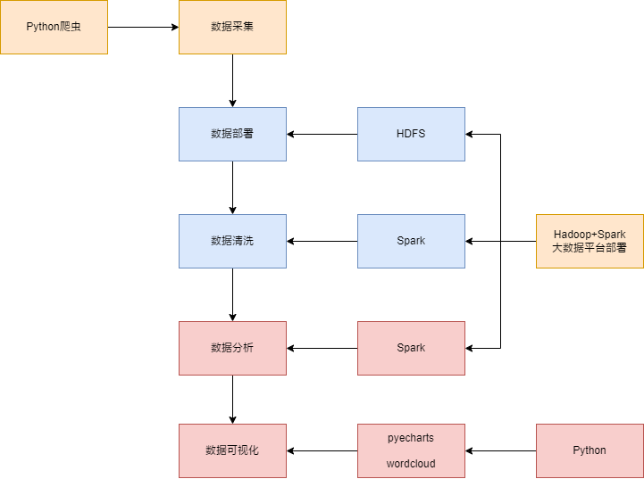

# 基于OfferShow的应届生薪资分析

## 一、项目架构

## 二、Hadoop+Spark大数据平台部署（已完成）

## 三、数据采集、数据部署与数据清洗

### 3.1 数据采集（已完成）

### 3.2 数据部署

把群文件的`OfferShow_salary_modify03.csv`导入到HDFS文件系统，由路旭完成。

### 3.3 数据清洗

1. 本地虚拟机部署Hadoop和Spark，然后把群文件的`OfferShow_salary_modify03.csv`导入到HDFS文件系统。
2. 编写Spark程序，调用HDFS的数据进行数据清洗，主要是薪资。（由瞿放、夏琦分别完成，可以进行交流完善清洗程序）

> **基本思路**
>
> 1. 主要采用正则表达式分析进行处理。很多数字带有小数点，注意匹配。
>2. 先删除全部实习数据，数据量过少，分析效果不好。
> 3. 新建一列，title：`年薪`
>4. 如果有`=`，只截取`=`右边的字符
> 5. 替换：将`-`、`~`、`～`、`至`、`到`等离其最近的左右的数字进行求平均值并替换，类似`14-16`
>6. 替换：将`w`、`W`、`万`之前最近的数字替换为新的数字，结果为`数字*10000`
> 7. 替换：将`k`、`K`、`千`之前最近的数字替换为新的数字，结果为`数字*1000`
>8. 替换：如果存在`/月`，替换为`*12`
> 9. 替换：如果存在`/天`，替换为`*30`
>10. 替换：将`＊`、`x`、`X`、`×`、`乘`替换为`*`
> 11. 替换：将`＋`替换为`+`
>12. 替换：匹配`(+)`、`（+）`，如果匹配成功就把`+`两边的数字相加并替换原括号
> 13. 删除所有符号，只保留`数字`、`*`、`+`
>14. 进行乘法`*`运算，替换运算结果
> 15. 进行加法`+`运算，替换运算结果
>16. 如果最后结果小于100，表示没写单位，考虑为年薪，直接将数字替换为新的数字，结果为`数字*10000`
> 17. 如果最后结果小于50000，考虑只写了月薪的情况，直接将数字替换为新的数字，结果为`数字*12`
>
> 以上基本覆盖大部分情况。

3. 把编好的源程序代码发给路旭，使用云服务器进行分布式运算，过程中注意**截图保留相关证据**，完成数据清洗。

## 四、数据分析与数据可视化

### 4.1 数据分析

1. 编写Spark程序，调用HDFS的数据进行数据分析，主要是聚类。包括下面一些基本要求。（由瞿放、夏琦分别完成）

+ 对评论进行词频统计
+ 对不同学历的平均薪资进行统计
+ 对不同行业的平均薪资进行统计
+ 对各个地域offer数量进行统计
+ 对各个地域offer平均薪资进行统计
+ 对各个公司进行offer数量统计
+ 对各个公司进行offer平均薪资进行统计
+ 对岗位名进行offer数量统计，输出结果。需要合并Java，C/C++，php，Android，IOS，golang，python，嵌入式等其它各个语言
+ 对各个岗位平均薪资进行统计
+ 对各个学历，不同年份时间的offer薪资进行统计
+ 对各个地域，不同年份时间的offer数量进行统计
+ 对各个地域，不同年份时间的平均薪资进行统计
+ 对各个公司，不同年份时间的offer数量进行统计
+ 对各个公司，不同年份时间的平均薪资进行统计
+ 对各种语言，不同年份时间的offer数量进行统计
+ 对各种语言，不同年份时间的平均薪资进行统计
+ …

2. 把编好的源程序代码发给路旭，使用云服务器进行分布式运算，过程中注意**截图保留相关证据**，完成数据分析。

